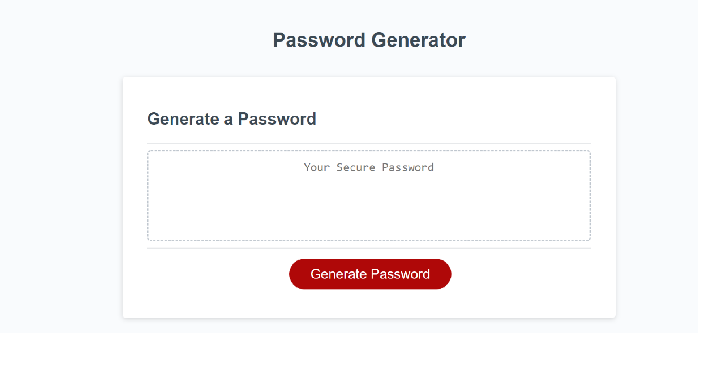

# 03 JavaScript: Password Generator

This application will randomly generate a password with options that the user will choose from. Utilizing prompts and confirm methods, the user will decide if they want upper case and/or lower case letters, numbers, and special characters with a minimum character length of 8 and a maximum character length of 128. Building this app allows users to easily create a browser secure password from options that they want! JavaScript is the only language used for the back end of this application. HTML and CSS were used to make this application look beautiful! Through building this password generator, I was able to discover how to create and access objects as well as functions.

## Usage

simply click the red generate password button on the screen and follow the prompts on the window to create your new and safe password!

